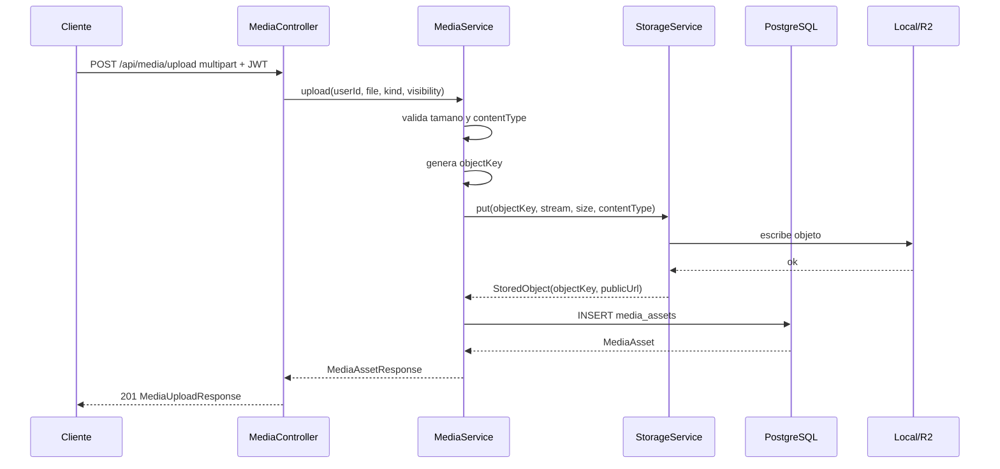

# Modulo: Multimedia y almacenamiento

Paquetes raiz: `com.versus.api.media`, `com.versus.api.storage`  
Estado: implementado (dependencia #121)

---

## Responsabilidad

Centraliza la subida, validacion, almacenamiento y consulta de metadatos de assets usados por la aplicacion. El modulo `media` contiene reglas de negocio, permisos y metadatos persistidos; el modulo `storage` abstrae el proveedor fisico para poder usar almacenamiento local en desarrollo/tests y Cloudflare R2 en produccion.

Este modulo no decide donde se muestran los assets. Otros modulos, como `users`, consumen `MediaService` para casos concretos como avatar de perfil.

---

## Diagrama de clases

```mermaid
classDiagram
    class MediaController {
        <<RestController>>
        <<RequiresAuth>>
        +POST /api/media/upload
        +GET /api/media/me
        +GET /api/media/{id}
        +DELETE /api/media/{id}
    }

    class MediaService {
        <<Service>>
        -MediaAssetRepository assets
        -StorageService storage
        -StorageProperties properties
        +upload(UUID, MultipartFile, MediaKind, MediaVisibility) MediaAssetResponse
        +uploadAvatar(UUID, MultipartFile) MediaAssetResponse
        +get(UUID, UUID) MediaAssetResponse
        +listMine(UUID) List~MediaAssetResponse~
        +delete(UUID, boolean, UUID) void
    }

    class MediaAsset {
        <<Entity>>
        <<Table: media_assets>>
        +UUID id
        +UUID ownerId
        +MediaKind kind
        +String originalFilename
        +String objectKey
        +String contentType
        +long sizeBytes
        +MediaVisibility visibility
        +String publicUrl
        +Instant createdAt
    }

    class MediaKind {
        <<Enumeration>>
        IMAGE
        VIDEO
        AUDIO
        DOCUMENT
        OTHER
    }

    class MediaVisibility {
        <<Enumeration>>
        PUBLIC
        PRIVATE
    }

    class MediaAssetRepository {
        <<Repository>>
        +findAllByOwnerIdOrderByCreatedAtDesc(UUID) List~MediaAsset~
    }

    class StorageService {
        <<Interface>>
        +put(String, InputStream, long, String) StoredObject
        +delete(String) void
    }

    class LocalStorageService {
        <<Service>>
        <<Provider: local>>
    }

    class R2StorageService {
        <<Service>>
        <<Provider: r2>>
    }

    class StoredObject {
        <<DTO>>
        +String objectKey
        +String publicUrl
    }

    class MediaAssetResponse {
        <<DTO>>
        +String id
        +MediaKind kind
        +String filename
        +String contentType
        +long sizeBytes
        +MediaVisibility visibility
        +String url
        +Instant createdAt
    }

    MediaController --> MediaService : delega
    MediaService --> MediaAssetRepository : consulta/persiste
    MediaService --> StorageService : almacena objetos
    MediaAssetRepository --> MediaAsset : gestiona
    MediaAsset --> MediaKind : usa
    MediaAsset --> MediaVisibility : usa
    LocalStorageService ..|> StorageService
    R2StorageService ..|> StorageService
    StorageService ..> StoredObject : produce
    MediaService ..> MediaAssetResponse : produce
```

---

## Endpoints

| Metodo | Ruta | Auth | Body/Parametros | Respuesta |
|---|---|---|---|---|
| `POST` | `/api/media/upload` | Bearer | `multipart/form-data`: `file`, `kind?`, `visibility?` | `201` `MediaUploadResponse` |
| `GET` | `/api/media/me` | Bearer | - | `200` `List<MediaAssetResponse>` |
| `GET` | `/api/media/{id}` | Bearer | - | `200` `MediaAssetResponse` |
| `DELETE` | `/api/media/{id}` | Bearer | - | `204` |
| `PUT` | `/api/users/me/avatar` | Bearer | `multipart/form-data`: `file` | `200` `UserMeResponse` |

### Subida generica

`POST /api/media/upload` acepta un archivo multipart y dos campos opcionales:

| Campo | Tipo | Default | Uso |
|---|---|---|---|
| `file` | `MultipartFile` | obligatorio | Contenido a almacenar |
| `kind` | `MediaKind` | `OTHER` | Clasifica el asset para organizar la key |
| `visibility` | `MediaVisibility` | `PRIVATE` | Controla quien puede consultar los metadatos |

La respuesta envuelve el asset persistido:

```json
{
  "asset": {
    "id": "2f7c9a6e-5c2b-4cc9-90f5-3c13c29b0b3f",
    "kind": "IMAGE",
    "filename": "avatar.png",
    "contentType": "image/png",
    "sizeBytes": 34567,
    "visibility": "PUBLIC",
    "url": "https://cdn.example.com/image/2026/05/.../file.png",
    "createdAt": "2026-05-07T15:00:00Z"
  }
}
```

### Avatar de usuario

`PUT /api/users/me/avatar` reutiliza `MediaService.uploadAvatar(...)`, fuerza:

- `kind = IMAGE`
- `visibility = PUBLIC`
- limite especifico `versus.storage.max-avatar-size-bytes`
- MIME de imagen (`image/jpeg`, `image/png`, `image/webp`, `image/gif`)

Despues de almacenar el asset, actualiza `users.avatar_url` con la URL devuelta por el provider.

### Errores comunes

| Situacion | ErrorCode | HTTP |
|---|---|---|
| Archivo ausente o vacio | `VALIDATION_ERROR` | 400 |
| Tamano superior al limite configurado | `VALIDATION_ERROR` | 400 |
| MIME no permitido | `VALIDATION_ERROR` | 400 |
| Avatar con MIME que no es imagen | `VALIDATION_ERROR` | 400 |
| Asset inexistente | `NOT_FOUND` | 404 |
| Consultar asset privado ajeno | `FORBIDDEN` | 403 |
| Borrar asset ajeno sin rol ADMIN | `FORBIDDEN` | 403 |

---

## Entidad: `MediaAsset`

```
Tabla: media_assets
┌───────────────────┬────────────────────────────────────────────────────┐
│ Columna           │ Notas                                              │
├───────────────────┼────────────────────────────────────────────────────┤
│ id                │ UUID, PK, generado automaticamente                 │
│ owner_id          │ UUID del usuario propietario                       │
│ kind              │ ENUM(IMAGE, VIDEO, AUDIO, DOCUMENT, OTHER)         │
│ original_filename │ VARCHAR(255), nombre recibido del cliente          │
│ object_key        │ VARCHAR(512), UNIQUE, key interna del provider     │
│ content_type      │ VARCHAR(128), MIME normalizado                     │
│ size_bytes        │ BIGINT, tamano del archivo                         │
│ visibility        │ ENUM(PUBLIC, PRIVATE), default PRIVATE             │
│ public_url        │ VARCHAR(1024), nullable                            │
│ created_at        │ TIMESTAMPTZ, @PrePersist                           │
└───────────────────┴────────────────────────────────────────────────────┘
Indices: owner_id, object_key (UNIQUE)
```

### Lifecycle hooks JPA

- `@PrePersist`: inicializa `createdAt`, `visibility = PRIVATE` y `kind = OTHER` si no vienen definidos.

### Relacion con `users`

`MediaAsset.ownerId` guarda el UUID del usuario propietario, pero no define una relacion JPA con `User`. Esto mantiene el modulo desacoplado y evita cargar usuarios al listar assets.

---

## Proveedores de almacenamiento

### `StorageService`

Interfaz minima que oculta el proveedor fisico:

```java
StoredObject put(String objectKey, InputStream content, long sizeBytes, String contentType);
void delete(String objectKey);
```

`MediaService` genera la `objectKey`, valida el archivo y persiste metadatos. El provider solo escribe o borra bytes.

### Provider `local`

Activo por defecto con:

```properties
versus.storage.provider=local
```

Escribe en `versus.storage.local-root`, pensado para desarrollo y tests. Si `versus.storage.public-base-url` esta vacio, `publicUrl` queda `null`.

### Provider `r2`

Activo con:

```properties
versus.storage.provider=r2
```

Usa Cloudflare R2 mediante la API S3-compatible del AWS SDK v2. Requiere endpoint, bucket y credenciales configuradas por entorno.

---

## Configuracion

| Propiedad | Default | Uso |
|---|---|---|
| `spring.servlet.multipart.max-file-size` | `${MEDIA_MAX_FILE_SIZE:10MB}` | Limite multipart de Spring |
| `spring.servlet.multipart.max-request-size` | `${MEDIA_MAX_REQUEST_SIZE:10MB}` | Limite total de request |
| `versus.storage.provider` | `local` | Provider activo: `local` o `r2` |
| `versus.storage.local-root` | `target/local-storage` | Carpeta del provider local |
| `versus.storage.bucket` | `versus-media-dev` | Bucket R2 |
| `versus.storage.public-base-url` | vacio | Base CDN/publica para construir `publicUrl` |
| `versus.storage.max-file-size-bytes` | `10485760` | Limite de assets genericos |
| `versus.storage.max-avatar-size-bytes` | `2097152` | Limite especifico de avatar |
| `versus.storage.allowed-content-types` | lista segura | MIME aceptados |
| `versus.storage.r2.endpoint` | vacio | Endpoint S3-compatible de R2 |
| `versus.storage.r2.access-key-id` | vacio | Access key de R2 |
| `versus.storage.r2.secret-access-key` | vacio | Secret key de R2 |

Variables equivalentes en `.env.example`:

```bash
STORAGE_PROVIDER=local
STORAGE_LOCAL_ROOT=target/local-storage
MEDIA_MAX_FILE_SIZE=10MB
MEDIA_MAX_REQUEST_SIZE=10MB
MEDIA_MAX_FILE_SIZE_BYTES=10485760
MEDIA_MAX_AVATAR_SIZE_BYTES=2097152
R2_ENDPOINT=
R2_ACCESS_KEY_ID=
R2_SECRET_ACCESS_KEY=
R2_BUCKET=versus-media
R2_PUBLIC_BASE_URL=
```

---

## Reglas de negocio

1. Los endpoints de media requieren Bearer token.
2. El nombre original nunca se usa como ruta completa; solo se conserva como metadato y extension.
3. La `objectKey` se genera con tipo, fecha, owner y UUID para evitar colisiones.
4. Un asset privado solo puede consultarlo su propietario.
5. Un asset solo puede borrarlo su propietario o un usuario con rol ADMIN.
6. La subida de avatar siempre genera un asset publico de tipo `IMAGE`.
7. Los limites de Spring multipart y los limites de negocio deben mantenerse alineados.

---

## Flujo de subida



---

## Extension futura

- URLs firmadas para subida directa desde frontend a R2.
- URLs firmadas de lectura para assets privados.
- Integracion con Cloudflare Images para variantes, resizing y optimizacion.
- Limpieza programada de objetos huerfanos si falla la persistencia tras subir a R2.
- Paginacion y filtros en `/api/media/me` cuando el volumen de assets crezca.
